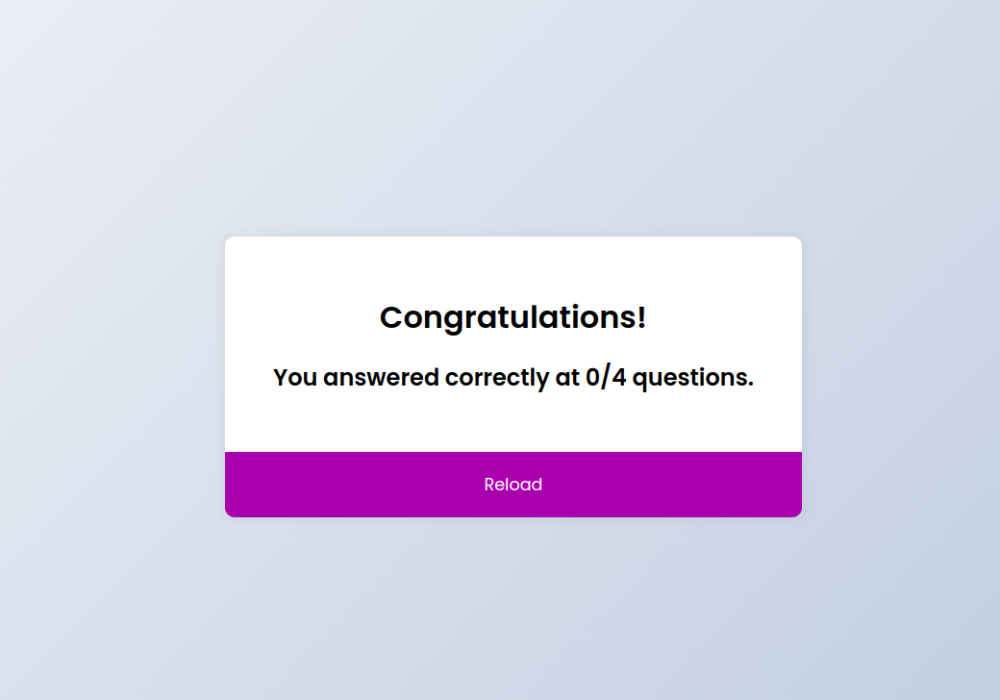

<table>
<tr>
    <td valign="center">
        
    </td>
    <td valign="center">
    
</td>
    <td valign="center">

</td>
    <td valign="center">

</td>
    <td valign="center">

</td>
</tr>
</table>

<table width="100%">
<tr>
   <th> Hey there 👋</th>   
   <th> 🎯 2023 Goals</th>   
</tr> 

<tr>
   <td style="white-space:nowrap;" width="20%">

     ✨ This is Dip from Dhaka, Bangladesh.
     🌱 I’m Full-stack engineer,creative coder.
     🎓 I’m concluded my MSc. in CSE
     🌱 I’m currently learning everything 🤣
   ### ⚡ Fun fact 
      🌱 Love to travel and take photos. 
      💼 Any freelance work? do reach
      💬 dipghosh638@gmail.com 🎯 +8801744499902
      💬 Ask me about anything,I’m happy to help.

   </td>

   <td style="white-space:nowrap;" width="30%;">

     🔥 Atleast solve one problem daily. 
     🔥 A single commit daily.
     🔥 Target 300 problems to solve from Leet Code.
     🔥 Focus on Pure Javascript,Vue JS,and Nuxt JS.
     🔥 Improve the previous code with coding best practice.
     🔥 Become a better developer.
     🌱 Learning Docker & CI/CD & Kubernate for the future.
     🌱 Micro Service Architecture.
     ✨ System Design
     ✨ Design Patterns
   </td>

</tr>
</table>

<table>
  <tr>
      <td valign="center"  width="30%" style="white-space:nowrap;">
        
        </td>
      <td valign="center" width="40%" style="white-space:nowrap;">
        
      </td>
      <td  valign="center" width="30%" style="white-space: nowrap; ">
    
</td>

</tr>
</table>

<table>
<tr>

   | Programming Language | Backend Frameworks                                                                                                                                                                                                                                                                                                                      | Frontend Frameworks & Library                                                                                                                                                                                                                                                                                                                                                                                                           | Technology Miscellaneous                                                                                                                                                                                                                                                                                                                | Environment |
   |:----------------------------------------------------------------------------------------------------------------------------------------------------------------------------------------------------------------------------------------------------------------------------------------------------------------------------------------|:----------------------------------------------------------------------------------------------------------------------------------------------------------------------------------------------------------------------------------------------------------------------------------------------------------------------------------------------------------------------------------------------------------------------------------------|:----------------------------------------------------------------------------------------------------------------------------------------------------------------------------------------------------------------------------------------------------------------------------------------------------------------------------------------| :----- | :---------- |
   |      |   |     |    |        |
</tr>
</table>

<table ccellspacing="0" style="border-collapse: collapse;border-spacing: 0;">

### Frontend Projects
 <tr>
<table>
<tr>
<td> </td>
<td> </td>
<td> </td>
<td> </td>
</tr> 
<tr>
<td> </td>

</tr>
</table>
</tr> 
</table>

<table cellspacing="0" style="border-collapse: collapse;border-spacing: 0;">

### Backend Projects
<tr>
<td>
<table>
<tr>
 

</tr>
<tr>

</tr>
<tr>

</tr>
</table>
</td>
</tr>
</table>

<table cellspacing="0">
<tr>
<td width="50%" height="50%" align="center" style="white-space: nowrap;">

</td>
 <td valign="center" width="20%" style="white-space: nowrap; ">

</td>
<td  width="30%">

#### 📝 Latest Blog Posts
- [Git ,a simple guide  for  version control system ,no deep shit.](https://wordpress.com/post/dipghosh.home.blog/44)
- [Writing Maintainable Code using SOLID Design Principles Explained in Laravel(Interface Segregation Principle)](https://wordpress.com/post/dipghosh.home.blog/86)
- [Writing Maintainable Code using SOLID Design Principles Explained in Laravel(Single Responsibility Principle)](https://wordpress.com/post/dipghosh.home.blog/66)
- [Simple Javascript Vouchar](https://wordpress.com/post/dipghosh.home.blog/37)

</td>
</tr>
</table>
